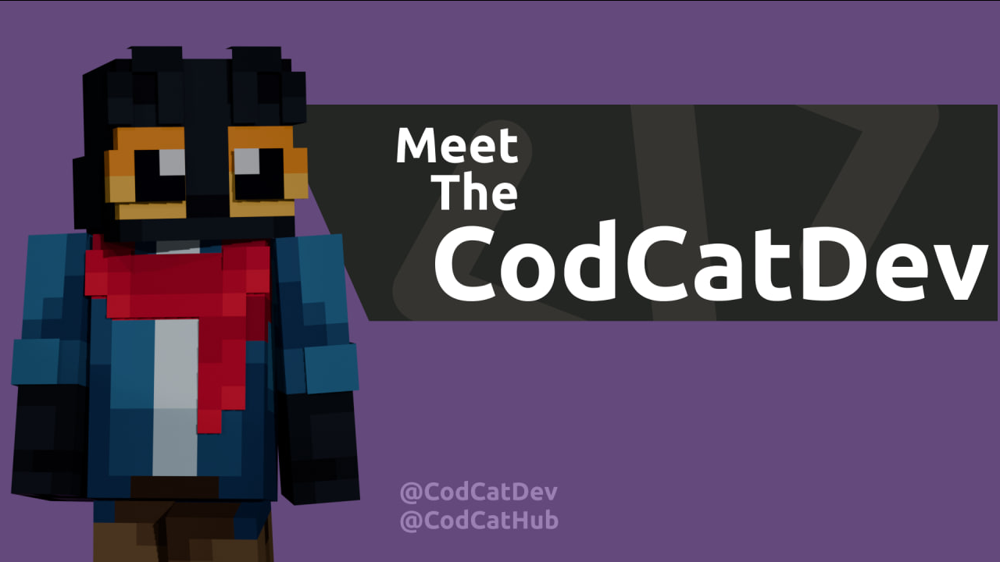

    

    <h1>[ <b>CodCatDev</b> ]</h1>

---

<h3>I am a <b>12-year-old</b> developer from <b>Russia</b>, I developing Full-Stack projects on <b>Python</b> and <b>JavaScript</b>, also using <b>PHP</b></h3>

---

  

---

